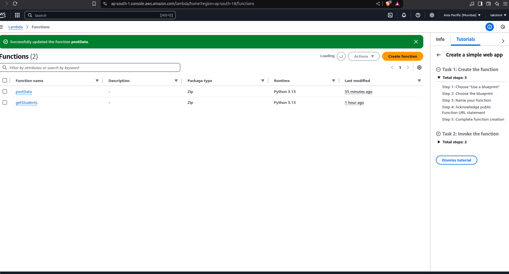
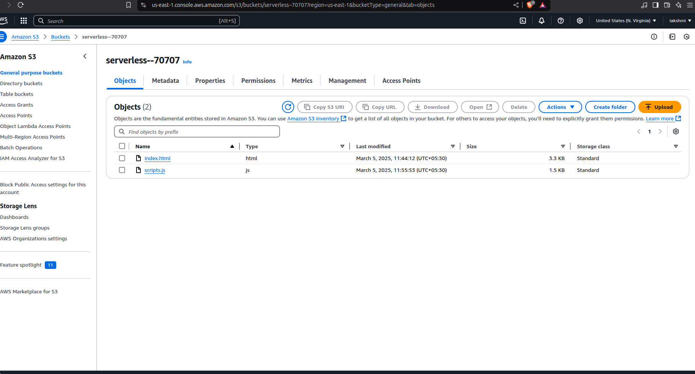
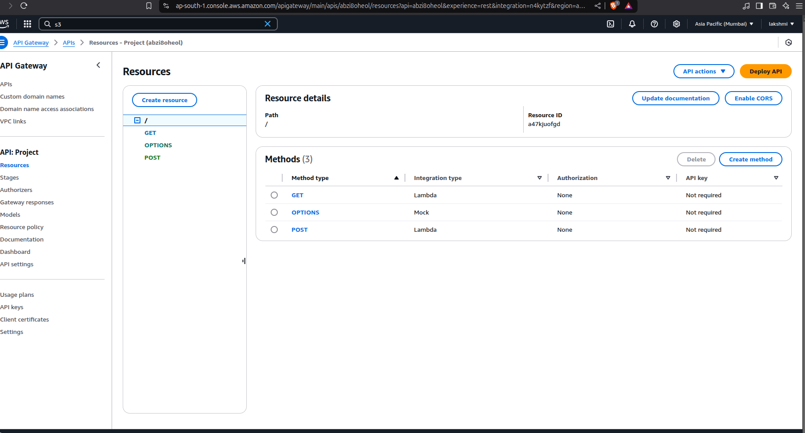
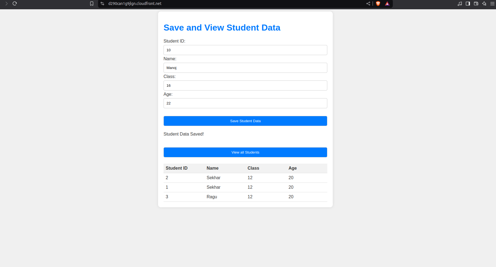

# Pyhton Application Deployment Using Aws Serverless
## Lambda Functions

## Static Website Hosting in S3 Buckets and then Configured Cloudfront

## API Gateway Deployment

## Final Hosted Website Hosted in s3 and accesed behind a cloud front Distribution
